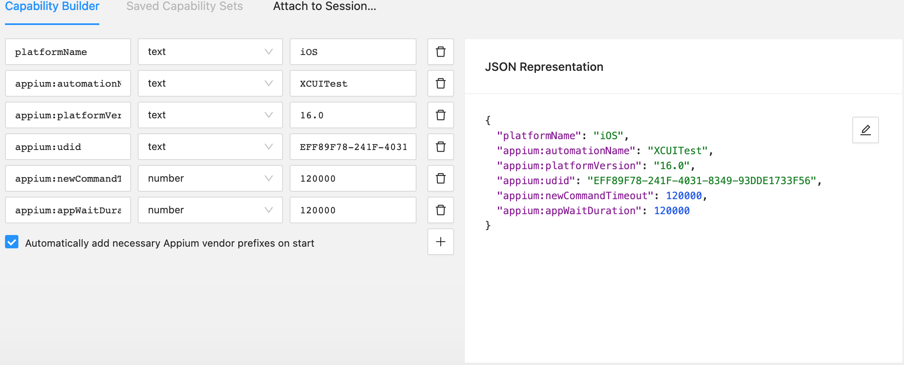

## IOS
##  Simulator
 - Máy ảo trên Máy Mac được thực hiện như sau:
   + Kiểm tra máy đã cài đặt app: Xcode chưa nếu chưa chúng ta hãy lên App Store để tải về
   ```
    xcode-select --install
   ```
   + Sau đó chúng ta bật Xcode
   + Mở Xcode ở bên tay trái -> Open Developer Tooler -> Simulator


Sau đó chúng ta mở AppSimulator và chọn thiết bị mà chúng ta sử dụng:

File -> OpenSimulator -> (Chọn thiết bị mình sử dụng)


## Webdriver
WebDriverAgent (WDA) là một công cụ quan trọng trong việc kiểm thử tự động cho các ứng dụng iOS

Định nghĩa: WebDriverAgent là một máy chủ test do Facebook phát triển, cho phép kiểm soát các thiết bị iOS từ xa bằng cách sử dụng giao thức WebDriver.
- Chức năng chính:
  + Cung cấp một giao diện WebDriver để tương tác với ứng dụng iOS.
  + Cho phép thực hiện các hành động như nhấn, vuốt, nhập liệu trên thiết bị iOS.
  + Truy xuất thông tin về các phần tử UI và trạng thái của ứng dụng.
- Cách hoạt động:
  + WDA chạy như một ứng dụng riêng biệt trên thiết bị iOS.
  + Nó sử dụng XCTest framework của Apple để tương tác với ứng dụng đang được kiểm thử.
  + Giao tiếp với máy tính thông qua giao thức HTTP.
- Tích hợp với Appium:
  + Appium sử dụng WebDriverAgent như một bridge để kiểm soát các thiết bị iOS.
  + Khi bạn chạy test iOS với Appium, nó sẽ tự động cài đặt và khởi chạy WDA trên thiết bị.
- Ưu điểm:
  + Cho phép kiểm thử tự động trên các thiết bị iOS thật và máy ảo.
  + Hỗ trợ nhiều loại tương tác phức tạp như đa chạm, 3D Touch.
  + Tương thích với nhiều phiên bản iOS khác nhau.
- Khó khăn:
  + Đôi khi gặp vấn đề về hiệu suất hoặc độ ổn định.
  + Cần cập nhật thường xuyên để tương thích với các phiên bản iOS mới.

Cài đặt và sử dụng:

Mở terminal:
  ```
  npm install -g appium
  ```
Sau đó chúng ta sẽ mở appium driver list:
  ```
  appium driver list
  ```
Tiếp theo chúng ta đi đến thư mục và lưu lại đường dẫn WebDriverAgent.xcodeproj

VD:
```
open ~/.appium/node_modules/appium-xcuitest-driver/node_modules/appium-webdriveragent/WebDriverAgent.xcodeproj
```
## UDID
- UDID (Unique Device Identifier) là một chuỗi ký tự duy nhất được sử dụng để định danh một thiết bị di động cụ thể. Đây là một khái niệm quan trọng trong việc phát triển và kiểm thử ứng dụng di động.
Chúng ta kiểm tra thiết bị kết nối với máy mac

Hiện tại chúng ta đang sử dụng máy ảo(thiết bị: Iphone 14 Pro Max)
```
xcrun simctl list devices
```


Sau đó chúng ta sẽ Build WebDriverAgent.xcodeproj:
```
xcodebuild -project ~/.appium/node_modules/appium-xcuitest-driver/node_modules/appium-webdriveragent/WebDriverAgent.xcodeproj -scheme WebDriverAgentRunner -destination 'id=EFF89F78-241F-4031-8349-93DDE1733F56' test
```
 - xcodeproj : Đây là công cụ dòng lệnh của Xcode để xây dựng và kiểm thử các dự án Xcode.
 - -project ~/.appium/node_modules/appium-xcuitest-driver/node_modules/appium-webdriveragent/WebDriverAgent.xcodeproj:
    + Chỉ định đường dẫn đến file project của WebDriverAgent.
    + WebDriverAgent là một thành phần quan trọng được sử dụng bởi Appium để tương tác với các ứng dụng iOS.
 - -scheme WebDriverAgentRunner:
    + Chỉ định scheme cần được xây dựng và chạy.
    + WebDriverAgentRunner là scheme chính của WebDriverAgent.
 - -destination 'id=EFF89F78-241F-4031-8349-93DDE1733F56':
    + Chỉ định thiết bị đích để chạy WebDriverAgent.
    + 'id=...' là UDID của thiết bị iOS cụ thể.(EFF89F78-241F-4031-8349-93DDE1733F56là của máy ảo)
 - test:
    + Chỉ thị xcodebuild để chạy các bài kiểm tra của dự án.
    + Trong trường hợp này, nó sẽ cài đặt và chạy WebDriverAgent trên thiết bị đã chỉ định.

Sau khi đã Buil thành công chúng ta sẽ có App WebDriverAgent:


## Appium Inspector 
Để sử dụng bên AppiumInspector chúng ta cần lưu ý như sau:

 
- "Remote Host" là địa chỉ IP hoặc tên miền của máy chủ Appium mà Appium Inspector sẽ kết nối đến.

- "127.0.0.1": Đây là địa chỉ IP loopback, còn được gọi là localhost. Nó đại diện cho máy tính hiện tại mà bạn đang sử dụng.

- Khi bạn sử dụng "127.0.0.1", điều này có nghĩa là Appium Inspector sẽ cố gắng kết nối với Appium Server đang chạy trên chính máy tính của bạn. Nó chỉ ra rằng bạn đang chạy Appium Server và Appium Inspector trên cùng một máy.


- "Remote Port" là số cổng mạng mà Appium Server đang lắng nghe các kết nối đến.
- "4723": Đây là cổng mặc định mà Appium Server thường sử dụng. Nó xác định cổng cụ thể trên máy chủ mà Appium Inspector sẽ cố gắng kết nối đến.

- Khi bạn chạy Appium Server, nó sẽ "lắng nghe" trên cổng này để nhận các yêu cầu từ client (trong trường hợp này là Appium Inspector). Appium Inspector sẽ sử dụng cổng này để gửi các lệnh và nhận phản hồi từ Appium Server.
- Kết hợp với Remote Host, nó tạo thành địa chỉ đầy đủ để kết nối: 127.0.0.1:4723 Đảm bảo rằng giá trị này phải khớp với cổng mà Appium Server của bạn đang sử dụng.
Lưu ý:
Nếu bạn đã cấu hình Appium Server chạy trên một cổng khác, bạn cần điều chỉnh giá trị này cho phù hợp. Đảm bảo rằng cổng này không bị chặn bởi tường lửa hoặc đang được sử dụng bởi ứng dụng khác.


- "Remote Path" là đường dẫn URL cơ sở mà Appium Server sử dụng để xử lý các yêu cầu WebDriver.
- "/wd/hub/": Đây là đường dẫn mặc định được sử dụng bởi Appium Server.
- "wd" viết tắt cho "WebDriver".
- "hub" đề cập đến trung tâm điều khiển của Appium.
- Nó xác định phần cuối của URL mà Appium Inspector sẽ sử dụng để gửi các lệnh WebDriver đến Appium Server.
- Kết hợp với Remote Host và Remote Port, nó tạo thành URL đầy đủ để kết nối, ví dụ: http://127.0.0.1:4723/wd/hub/
- Appium sử dụng đường dẫn này để định tuyến các yêu cầu WebDriver đến các phần xử lý thích hợp trong server. Nó giúp phân biệt các yêu cầu WebDriver với các loại yêu cầu khác mà server có thể xử lý.

Đây sẽ là một số thông tin khi kết nối với vs thiết bị (Máy ảo):



Sau khi đã có thông số của máy ảo mà mình cần kết nối với AppiumInspector và thiết bị đó có WebDriverAgent.xcoderoj

Chúng ta sẽ mở Terminal của máy tính vả khởi động Server Appium có cổng là 4723 
```
appium --base-path=/wd/hub -p 4073
```
Quay lại AppiumInspector để Start Sesion