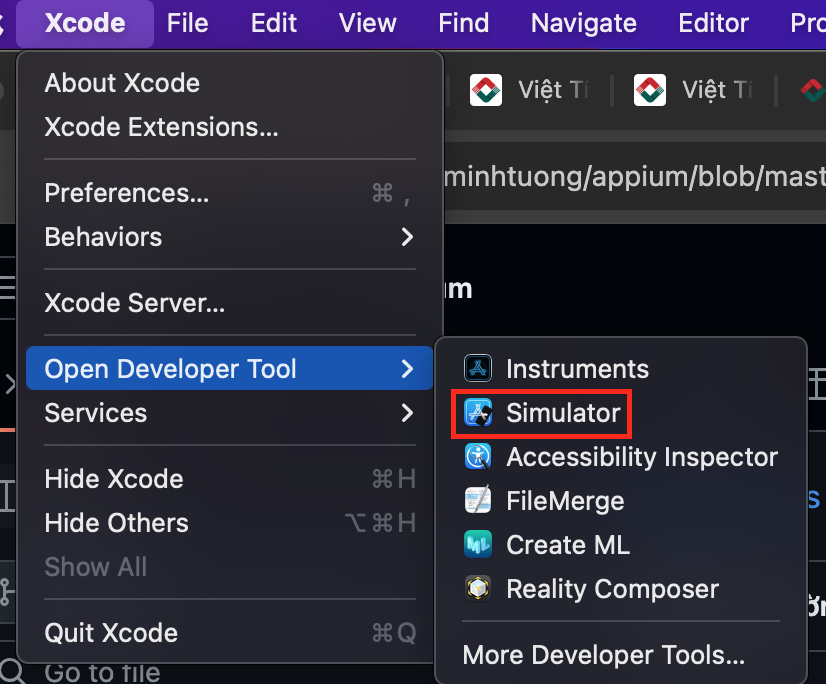
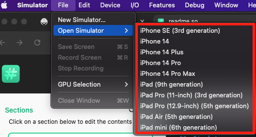
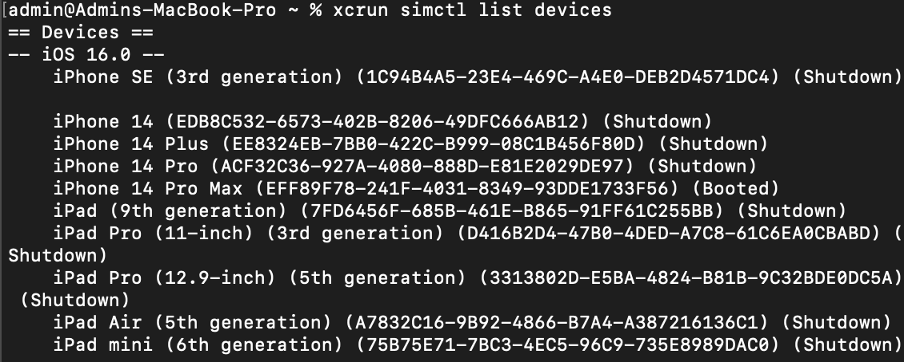
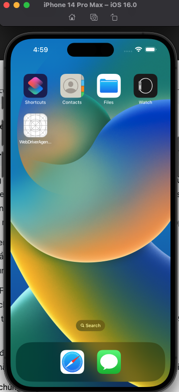

## IOS
##  Simulator
 - Máy ảo trên Máy Mac được thực hiện như sau:
   + Kiểm tra máy đã cài đặt app: Xcode chưa nếu chưa chúng ta hãy lên App Store để tải về
   + Sau đó chúng ta bật Xcode
   + Mở Xcode ở bên tay trái -> Open Developer Tooler -> Simulator



Sau đó chúng ta mở AppSimulator và chọn thiết bị mà chúng ta sử dụng:

File -> OpenSimulator -> (Chọn thiết bị mình sử dụng)



## Webdriver
WebDriverAgent (WDA) là một công cụ quan trọng trong việc kiểm thử tự động cho các ứng dụng iOS

Định nghĩa: WebDriverAgent là một máy chủ test do Facebook phát triển, cho phép kiểm soát các thiết bị iOS từ xa bằng cách sử dụng giao thức WebDriver.
- Chức năng chính:
  + Cung cấp một giao diện WebDriver để tương tác với ứng dụng iOS.
  + Cho phép thực hiện các hành động như nhấn, vuốt, nhập liệu trên thiết bị iOS.
  + Truy xuất thông tin về các phần tử UI và trạng thái của ứng dụng.
- Cách hoạt động:
  + WDA chạy như một ứng dụng riêng biệt trên thiết bị iOS.
  + Nó sử dụng XCTest framework của Apple để tương tác với ứng dụng đang được kiểm thử.
  + Giao tiếp với máy tính thông qua giao thức HTTP.
- Tích hợp với Appium:
  + Appium sử dụng WebDriverAgent như một bridge để kiểm soát các thiết bị iOS.
  + Khi bạn chạy test iOS với Appium, nó sẽ tự động cài đặt và khởi chạy WDA trên thiết bị.
- Ưu điểm:
  + Cho phép kiểm thử tự động trên các thiết bị iOS thật và máy ảo.
  + Hỗ trợ nhiều loại tương tác phức tạp như đa chạm, 3D Touch.
  + Tương thích với nhiều phiên bản iOS khác nhau.
- Khó khăn:
  + Đôi khi gặp vấn đề về hiệu suất hoặc độ ổn định.
  + Cần cập nhật thường xuyên để tương thích với các phiên bản iOS mới.

Cài đặt và sử dụng:

Mở terminal:
  ```
  npm install -g appium
  ```
Sau đó chúng ta sẽ mở appium driver list:
  ```
  appium driver list
  ```
Tiếp theo chúng ta đi đến thư mục và lưu lại đường dẫn WebDriverAgent.xcodeproj

VD:
```
open ~/.appium/node_modules/appium-xcuitest-driver/node_modules/appium-webdriveragent/WebDriverAgent.xcodeproj
```
## UDID
- UDID (Unique Device Identifier) là một chuỗi ký tự duy nhất được sử dụng để định danh một thiết bị di động cụ thể. Đây là một khái niệm quan trọng trong việc phát triển và kiểm thử ứng dụng di động.
Chúng ta kiểm tra thiết bị kết nối với máy mac

Hiện tại chúng ta đang sử dụng máy ảo(thiết bị: Iphone 14 Pro Max)
```
xcrun simctl list devices
```


Sau đó chúng ta sẽ Build WebDriverAgent.xcodeproj:
```
xcodebuild -project ~/.appium/node_modules/appium-xcuitest-driver/node_modules/appium-webdriveragent/WebDriverAgent.xcodeproj -scheme WebDriverAgentRunner -destination 'id=EFF89F78-241F-4031-8349-93DDE1733F56' test
```
 - xcodeproj : Đây là công cụ dòng lệnh của Xcode để xây dựng và kiểm thử các dự án Xcode.
 - -project ~/.appium/node_modules/appium-xcuitest-driver/node_modules/appium-webdriveragent/WebDriverAgent.xcodeproj:
    + Chỉ định đường dẫn đến file project của WebDriverAgent.
    + WebDriverAgent là một thành phần quan trọng được sử dụng bởi Appium để tương tác với các ứng dụng iOS.
 - -scheme WebDriverAgentRunner:
    + Chỉ định scheme cần được xây dựng và chạy.
    + WebDriverAgentRunner là scheme chính của WebDriverAgent.
 - -destination 'id=EFF89F78-241F-4031-8349-93DDE1733F56':
    + Chỉ định thiết bị đích để chạy WebDriverAgent.
    + 'id=...' là UDID của thiết bị iOS cụ thể.(EFF89F78-241F-4031-8349-93DDE1733F56là của máy ảo)
 - test:
    + Chỉ thị xcodebuild để chạy các bài kiểm tra của dự án.
    + Trong trường hợp này, nó sẽ cài đặt và chạy WebDriverAgent trên thiết bị đã chỉ định.

Sau khi đã Buil thành công chúng ta sẽ có App WebDriverAgent:

