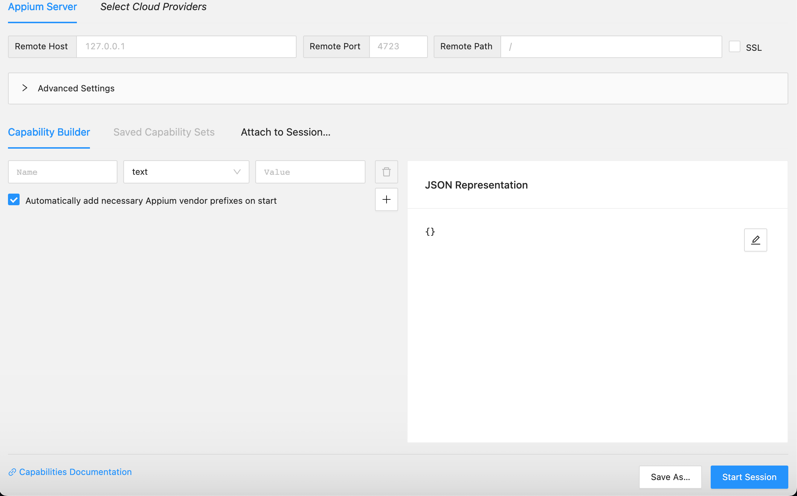

# AndroidStudio
## Để kiểm tra Appium đã sẵn sàng, hãy kiểm tra bằng cách dùng Appium-doctor

Install Appium-doctor:
```
npm Install appium-doctor
```
Run:
```
appium-doctor
```
- Các yêu cầu có thể bao gồm %ANDROID_HOME% %JAVA_HOME% trong biến môi trường hệ thống của bạn. Nếu chưa có, vui lòng làm theo hướng dẫn [here](https://www.programsbuzz.com/article/set-androidhome-environment-variable-windows-10).

- Thêm *%ANDROID_HOME%/platform-tools*, *%ANDROID_HOME%/tools*, *%ANDROID_HOME%/emulator* vào PATH.

- Cài đặt AndroidStudio: [Tại đây](https://developer.android.com/studio?hl=vi&_gl=1*13nbtcb*_up*MQ..&gclid=Cj0KCQjw9Km3BhDjARIsAGUb4nxE83LzsLCXHorK6mTbrHmwEg36Y1djCT1NdVVmVjN7lKX94c31t9waAhRSEALw_wcB&gclsrc=aw.ds)

## Để tạo một thiết bị ảo để kiểm thử
Mở Android Studio và tìm kiếm Create Device trong bảng Device Manager. 


Chọn một cấu hình phần cứng phù hợp từ danh sách hoặc nhấp vào New Hardware Profile để tạo một cấu hình tùy chỉnh cho thiết bị ảo của bạn.

Sau đó, chọn một hình ảnh cho hệ thống của bạn (phải là Android 11.0 trở lên, ví dụ: Tiramisu).


LƯU Ý: chọn một tên thiết bị ngắn gọn, dễ nhớ (ví dụ: test-1) để sử dụng với trình giả lập trong dòng lệnh sau này.



## Máy Thật 
Chúng ta phải bật Chế độ nhà phát triển thì mới có thể mở AppiumInspacetor trên đó


Có thể xem chi tiết [Tại đây](https://fptshop.com.vn/tin-tuc/danh-gia/tuy-chon-nha-phat-trien-159833)

Sau khi thiết bị ảo của bạn đang chạy hoặc một thiết bị di động được kết nối qua cáp, chạy lệnh *adb devices* trên terminal trong dòng lệnh để lấy định danh thiết bị kiểm thử của bạn.
```
adb devices
```
  *emulator -avd **(your virtual device name)***

Sau đó chúng ta sẽ lấy (emulator -avd **(your virtual device name)**) gắn vào trong thông tin máy của AppiumInspacetor


### Run
Chúng ta sẽ mở Terminal của máy tính vả khởi động Server Appium có cổng là 4723 
```
appium --base-path=/wd/hub -p 4073
```
Quay lại AppiumInspector để Start Sesion


